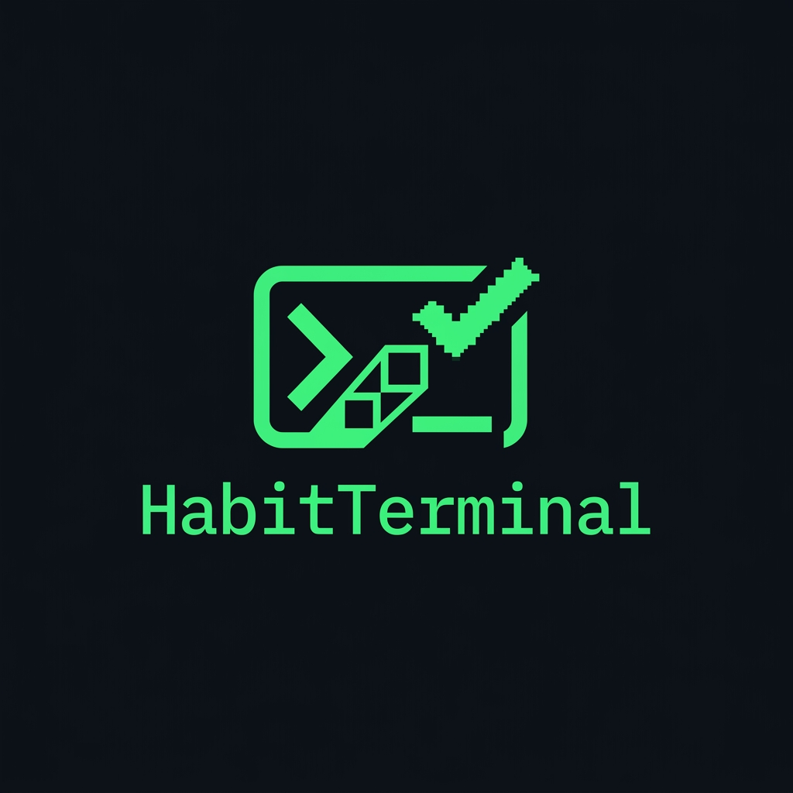

<div align="center">
  

  # HabitTerminal

  **A habit tracker and recovery companion with a GitHub-meets-terminal aesthetic.**

  Build daily routines, track recovery streaks, plan your week, and stay accountable — online or off.

  <sub>Next.js 16 · TypeScript · Supabase · Tailwind CSS v4 · Offline-first PWA</sub>
</div>

---

## Overview

HabitTerminal is a full-stack, responsive web app for building habits and sustaining recovery journeys, styled around an "Editorial Terminalism" design language — sharp corners, monospace accents, and a deep-obsidian dark theme. It works on desktop and mobile browsers, installs as a PWA, and keeps working when you go offline thanks to a local cache and background sync.

## Features

- **🔄 Today's Tasks** — Auto-generated daily tasks from recurring habits, with one-off tasks, retroactive catch-up for missed days, and idempotent generation (no duplicates).
- **📋 Habit Management** — Recurring habits with custom repeat rules (Daily / Weekdays / Weekends / Custom), priority levels, and activation toggles that only affect future generation.
- **🛡️ Recovery Journey** — Live timer (days/hours/minutes), "I Failed" logging with timestamps, milestone tracking (7 / 30 / 90 days), and resets — always derived from the database.
- **🤝 Competitive Journeys** — Shared recovery journeys you can join, leave, and compare against other participants.
- **🎯 Goals** — Track progress toward measurable goals with safe, concurrent increments.
- **🗓️ Planner & Prayer Planner** — Daily / weekly / monthly planning views, plus a dedicated prayer-time planner.
- **📊 Dashboard & Analytics** — GitHub-style contribution heatmap, streak calculations, completion rates, and trend charts.
- **📅 Calendar / History** — Month view with completion indicators and per-day failure reports.
- **🔐 Authentication** — Supabase Auth (email + Google OAuth) with secure server-side sessions.
- **📡 Offline-first PWA** — Local IndexedDB cache (Dexie), a sync queue, and a service worker so the app stays usable without a connection.

## Tech Stack

| Layer | Technology |
|-------|-----------|
| Framework | Next.js 16 (App Router) + TypeScript |
| Styling | Tailwind CSS v4 (dark mode) |
| State | Zustand |
| Charts | Recharts |
| Dates | dayjs |
| Backend / DB / Auth | Supabase (PostgreSQL + Auth) |
| Offline storage | Dexie (IndexedDB) + service worker |

## Getting Started

### Prerequisites

- Node.js 18+
- A [Supabase](https://supabase.com) project (free tier is fine)

### 1. Install

```bash
npm install
```

### 2. Configure environment

Copy the example file and fill in your Supabase credentials (found under **Settings → API** in the Supabase dashboard):

```bash
cp .env.example .env.local
```

### 3. Set up the database

In the Supabase **SQL Editor**, run the migrations in order:

1. `supabase/migration.sql` — core schema (users, habits, tasks, recovery)
2. `supabase/auth_integration.sql` — auth profile triggers
3. `supabase/migration_v2_journeys_goals.sql` — journeys & goals
4. The files in `supabase/migrations/` — additional planner / prayer / competitive features
5. `supabase-migration.sql` — RPCs (`increment_goal_progress`, `increment_journey_failure`)

### 4. Run the dev server

```bash
npm run dev
```

Visit **http://localhost:3000**.

## Scripts

| Command | Description |
|---------|-------------|
| `npm run dev` | Start the development server |
| `npm run build` | Production build |
| `npm run start` | Serve the production build |
| `npm run lint` | Run ESLint |

## Project Structure

```
src/
├── app/                # App Router pages + API routes
│   ├── api/            # Route handlers (tasks, habits, recovery, goals, journeys, …)
│   ├── today/  dashboard/  planner/  prayer-planner/
│   ├── recovery/  goals/  calendar/  habits/  settings/  login/
│   ├── layout.tsx      # Root layout (PWA manifest, fonts)
│   └── globals.css     # Design-system tokens
├── components/         # UI, layout, habits, recovery, dashboard, planner
├── lib/
│   ├── supabase.ts     # Server Supabase client
│   ├── auth.ts         # Auth helpers
│   ├── services/       # Business logic
│   └── offline/        # Dexie cache + sync queue + network status
├── utils/supabase/     # Browser / server / middleware clients
├── store/useStore.ts   # Zustand store
└── middleware.ts       # Session refresh
supabase/               # SQL schema, auth, and migrations
```

## Design System

**Editorial Terminalism — "The Sovereign Console"**

- **Background:** `#10141a` (deep obsidian), depth via tonal shifts rather than borders
- **Accent (success):** `#6cdd81` · **Info:** `#a2c9ff` · **Warning:** `#fabc45` · **Error:** `#ffb4ab`
- **Type:** Space Grotesk (headlines), Inter (body), JetBrains Mono (code)
- **Corners:** 2–4px max for a sharp, hard-tech feel
