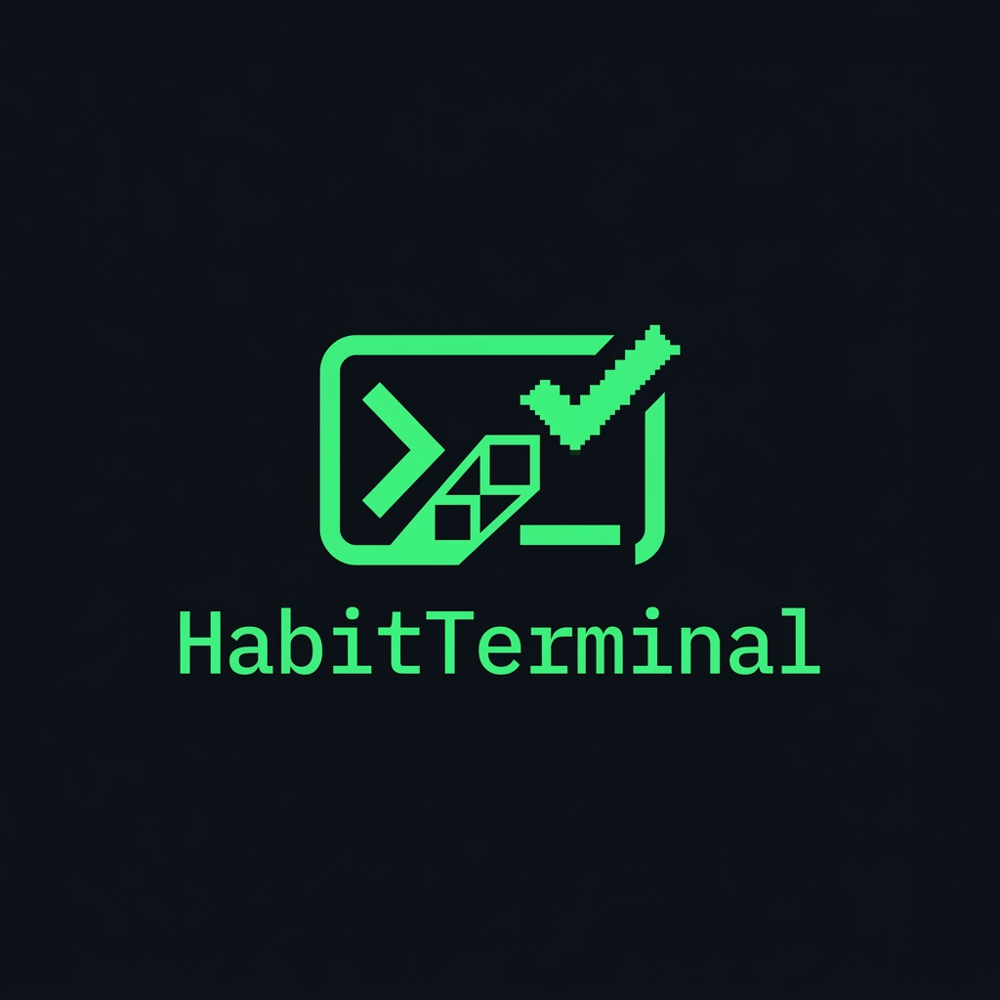

<div align="center">
  

  # HabitTerminal

  **A full-stack daily discipline operating system with a terminal/hacker aesthetic.**

  Track discipline, worship, recovery, focus, and habits — all in one place. Online or offline.

  <sub>Next.js 16 · TypeScript · PostgreSQL · Docker · Tailwind CSS v4 · Offline-first PWA</sub>
</div>

---

## Overview

HabitTerminal is a full-stack, responsive web app designed around the concept of **total daily discipline** — it tracks not just habits and tasks, but a holistic scoring system covering focus hours, all five daily prayers, recovery journeys, sleep, and discipline streaks. The design language is "Editorial Terminalism" — sharp corners, monospace accents, neon green accents, and a deep-obsidian dark theme. It works on desktop and mobile browsers, installs as a PWA, and keeps working offline with a local cache and background sync.

---

## Features

### 🧠 Daily Discipline System (v2.0)
- **Day Record** — One unified record per day capturing focus, worship, discipline, and sleep. Auto-scored 0–10 every time it's updated.
- **Today page** — a focused daily command center:
  - **FocusTimeCard** — log focus hours against your daily goal.
  - **WorshipCard** — all 5 daily prayers (Fajr/Dhuhr/Asr/Maghrib/Isha), plus Quran, Dhikr (morning/evening), Night Prayer, and 12 Sunnah Rakahs.
  - **RecoveryTodayCard** — No Reels / No Masturbation / Low Sugar / No Music / No Yapping toggles with journey-linked streaks.
  - **SleepCard** — sleep hours against your sleep goal.
  - **TopPrioritiesCard / EveningReviewCard** — the day's top priorities and an end-of-day review.
- **ScoreDisplay** — Live 0–10 score with per-category point breakdown and streak counters.
- **ActivityLog** — Terminal-style scrolling event log of all actions taken today.

### 🏆 Achievements (47 Total)
- 6 categories: STREAK / SCORE / WORSHIP / FOCUS / DISCIPLINE / COMPOUND
- 5 rarity tiers: COMMON → UNCOMMON → RARE → EPIC → LEGENDARY
- Progress bars for locked achievements, unlock dates for completed ones
- AchievementToast — auto-dismissing top-right notification on unlock, color-coded by rarity
- Sidebar badge pulses with the count of new unseen achievements
- `/achievements` page — accordion grouped by category, filter by locked/unlocked

### 🔄 Today's Tasks
- Auto-generated daily tasks from recurring habits with retroactive catch-up and idempotent generation
- One-off manual tasks with quick-add (`Enter`) or detailed form (`Shift+Enter`)
- **Inline edit** — hover to reveal edit/delete buttons; click edit to expand in-place form with title, description, category, and priority fields. `Enter` to save, `Escape` to cancel.
- Filter by status (Pending/Completed) and category
- Task completion logged to the Activity Log

### 📋 Habit Management
- Recurring habits with custom repeat rules (Daily / Weekdays / Weekends / Custom days)
- Priority levels and activation toggles (future-only effect)

### 🛡️ Recovery Journeys
- Live timer (days / hours / minutes), failure logging with timestamps, milestone tracking (7 / 30 / 90 days)
- **TODAY CLEAN ✓** / **FAILURE LOGGED ✗** status tag on each journey card
- Competitive shared journeys — join, leave, compare against other participants

### 🕌 Prayer Planner (Planner → Prayer view)
- Day plans organized by prayer block (Fajr / Dhuhr / Asr / Maghrib / Isha)
- Real prayer times via browser geolocation (falls back to stored defaults)
- **PERFORMED ✓** toggle on each prayer block — synced directly with the day record
- **ALL PRAYERS COMPLETE** banner appears when all 5 are done

### 🎯 Goals
- Progress tracking with safe concurrent increments via Postgres RPCs

### 📊 Dashboard & Analytics
- GitHub-style contribution heatmap
- **StreakMatrix** — current vs best for Focus / Prayer / No Reels / Discipline
- **SevenDayReport** — 7-day colored block grid (green → red by score)
- Recent achievements preview with link to full `/achievements` page
- Trend charts and completion rates

### 📅 Calendar / History
- Planner month view with plans per day; dashboard heatmap and 7-day report for history

### 🔐 Auth
- Email + password (scrypt-hashed) with HTTP-only, database-backed sessions

### 📡 Offline-first PWA
- Local IndexedDB cache (Dexie), sync queue, and service worker

---

## Scoring System

| Category | Points |
|---|---|
| Focus ≥ goal hours | +2 |
| All 5 prayers done | +2 |
| Quran + at least one Dhikr | +1 |
| Night prayer + 12 sunnah rakahs | +1 |
| Discipline (No Reels + No Masturbation + No Music) | +2 |
| Sleep ≥ goal hours | +1 |
| All of today's tasks/habits done | +1 |
| **Max** | **10** |

---

## Tech Stack

| Layer | Technology |
|-------|-----------|
| Framework | Next.js 16 (App Router) + TypeScript |
| Styling | Tailwind CSS v4 (dark mode) |
| State | Zustand |
| Charts | Recharts |
| Dates | dayjs |
| Database | PostgreSQL 17 (`pg`) |
| Auth | Local email/password + DB sessions |
| Runtime | Docker Compose (app + db) |
| Offline storage | Dexie (IndexedDB) + service worker |

---

## Getting Started

### Prerequisites

- Docker with the Compose plugin
- `make` (on Windows use WSL or Git Bash with make installed — or run the `docker compose` commands from the table below directly)

### Run it

```bash
make up
```

On first run this copies `.env.example` to `.env` (edit `POSTGRES_PASSWORD`, and optionally `GEMINI_API_KEY`, `TZ`, `PRAYER_CALC_METHOD`), builds the app image, starts Postgres, applies the SQL migrations in `db/migrations/`, and serves the app at **http://localhost:3000**. Register an account on the login page.

| Command | What it does | Equivalent |
|---------|--------------|------------|
| `make up` | Build and start app + database, then print the app URL | `docker compose up -d --build` |
| `make down` | Stop the containers (kept; `make up` resumes) | `docker compose stop` |
| `make clean` | Stop and delete containers, network and app image — **database kept** | `docker compose down --remove-orphans --rmi local` |
| `make fclean` | `clean` + delete the database volume — **all data lost** | `docker compose down --remove-orphans --rmi local --volumes` |
| `make re` | `fclean` then `up` | |
| `make migrate` | Apply any new SQL migrations to the running database | `docker compose run --rm migrate` |
| `make url` | Print the app URL (`APP_PORT` from `.env`, default 3000) | |
| `make logs` / `make ps` | Follow logs / list containers | |

### Database migrations

Migrations live in `db/migrations/`. On every `make up`, a one-shot `migrate` container applies any file not yet recorded in the `schema_migrations` table, in filename order, each in its own transaction — so to change the schema, add a new higher-numbered file and run `make up` (or `make migrate`).

### Deploying publicly

1. In `.env`: set `SITE_URL` to your public address (e.g. `https://habitterminal.example`) — it is baked into link previews, `robots.txt` and the sitemap at build time — and set a strong `POSTGRES_PASSWORD` **before the first `make up`** (see the note in `.env.example` for changing it later).
2. Put the app behind an HTTPS reverse proxy (Caddy, nginx, Traefik…) that forwards to port `APP_PORT`. The proxy must send `X-Forwarded-Proto` (session cookies are marked `Secure` when it says `https`) and `X-Forwarded-For` (used to rate-limit logins per client).
3. Keep Postgres private: `docker-compose.yml` binds it to `127.0.0.1` only — don't change that on a public server.
4. Back up the `habittracker_db-data` volume; `make fclean` deletes it.

### Local development (hot reload)

```bash
npm install
make up                # or just: docker compose up -d db
npm run dev            # uses DATABASE_URL from .env → the container DB on localhost:5433
```

---

## Scripts

| Command | Description |
|---------|-------------|
| `npm run dev` | Start the development server |
| `npm run build` | Production build |
| `npm run start` | Serve the production build |
| `npm run lint` | Run ESLint |

---

## AI features (Gemini)

Optional v2 AI assistants powered by the Gemini API via the official `@google/genai` SDK.
All Gemini calls happen **server-side only** through API routes — the key is never shipped to the browser.

- **AI Daily Planner** (Today page) — turns today's tasks/habits/goals + stats into a prioritized plan.
- **AI Goal Breaker** (Goals page) — breaks a goal into milestones, tasks, habits, risks, and first actions; you confirm before anything is created.
- **AI Weekly Review** (Weekly Review page) — analyzes the week's aggregated stats and can fill the reflection form.
- **AI Coach** (`/ai-coach`) — placeholder for a future chat (disabled).

**Environment variables** (server-only):

```
GEMINI_API_KEY=your-gemini-api-key      # required to enable AI features
GEMINI_MODEL=gemini-2.5-flash           # optional, this is the default
```

If `GEMINI_API_KEY` is unset, the app still runs normally and AI buttons show a safe "AI is not configured" message.

**Privacy:** only minimized, non-identifying data is sent to Gemini — generic item titles, life-area labels, statuses, due dates, priorities, completion rates, and (optionally) prayer-time labels. Emails, passwords, tokens, user ids, notes, and descriptions are never sent. Filtering lives in `src/lib/ai/privacy.ts` (plus Zod stripping in `schemas.ts`); raw prompts/responses are never logged.

**Docker:** set `GEMINI_API_KEY` (and optionally `GEMINI_MODEL`) in `.env`, then `make up` again to recreate the app container.

---

## Project Structure

```
src/
├── app/                      # App Router pages + API routes
│   ├── api/                  # Route handlers
│   │   ├── tasks/            # Task CRUD + monthly aggregation
│   │   ├── habits/           # Habit management
│   │   ├── day-record/       # Daily discipline record (GET + POST)
│   │   ├── achievements/     # 47 achievement definitions + unlock status
│   │   ├── user-stats/       # Streak matrix + cumulative totals
│   │   ├── user-preferences/ # Focus/sleep goals + notifications
│   │   ├── journeys/         # Recovery + competitive journeys
│   │   ├── goals/            # Goal progress
│   │   └── …
│   ├── today/                # Today page (daily command center)
│   ├── achievements/         # Achievements page (47 with rarity + progress)
│   ├── dashboard/            # Analytics + streak matrix + 7-day report
│   ├── recovery/             # Recovery journeys
│   ├── planner/              # Daily / weekly / monthly / prayer-block planner
│   ├── goals/  habits/  money/  learning/  life-areas/  weekly-review/  settings/  login/
│   ├── layout.tsx            # Root layout (PWA manifest, fonts)
│   └── globals.css           # Design-system tokens
├── components/
│   ├── today/                # FocusTimeCard, WorshipCard, RecoveryTodayCard, ScoreDisplay, …
│   ├── achievements/         # AchievementCard, AchievementToast
│   ├── dashboard/            # StreakMatrix, SevenDayReport, ChartWidgets, Heatmap
│   ├── recovery/             # TimerDisplay, FailureLogList, CompetitiveMode
│   ├── planner/              # PlanCard, PlanForm
│   ├── layout/               # Sidebar, AppShell, RootFrame
│   └── ui/                   # TaskItem (inline edit), StatCard, SectionHeader, …
├── lib/
│   ├── services/
│   │   └── dayRecordService.ts  # Typed day record CRUD + RPC wrapper
│   └── offline/              # Dexie cache + sync queue + network status
├── store/useStore.ts          # Zustand store (tasks, day record, achievements, stats, …)
├── lib/db/                    # Postgres pool + chainable query builder
└── lib/auth.ts                # Password hashing + session cookies
db/migrations/                 # SQL schema + RPCs, applied in order on first DB start
```

---

## Design System

**Editorial Terminalism — "The Sovereign Console"**

- **Background:** `#10141a` (deep obsidian), depth via tonal shifts rather than borders
- **Primary accent:** `#6cdd81` (neon green) — active states, scores, streaks
- **Info:** `#a2c9ff` · **Warning:** `#fabc45` · **Error:** `#ffb4ab`
- **Type:** Space Grotesk (headlines), Inter (body), JetBrains Mono (code/terminal)
- **Corners:** 2–4px max for a sharp, hard-tech feel
- **Terminal conventions:** `> command --flag` headings, `[LOG]` style entries, block-character progress bars (`█░`)
